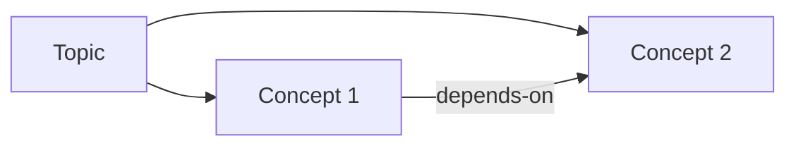

# Research Methodology — Reference

> Read this when running the `research` skill. Every section is prescriptive: pick the framework that fits the question, cite primary sources, prefer triangulation over volume, and treat freshness as a per-claim property.

Evidence protocol used throughout the skill: **URL + QUOTE + ACCESSED-AT + VERIFY-METHOD**. Every claim in `/docs/research/<topic>.md` must carry all four.

---

## 1. Academic Frameworks

### 1.1 PRISMA 2020

**PRISMA 2020** (Preferred Reporting Items for Systematic Reviews and Meta-Analyses) is the canonical reporting standard for systematic reviews.

- Page MJ, McKenzie JE, Bossuyt PM, et al. "The PRISMA 2020 statement: an updated guideline for reporting systematic reviews." _BMJ_ 2021;372:n71. doi:10.1136/bmj.n71. <https://www.bmj.com/content/372/bmj.n71>
- Page MJ, Moher D, Bossuyt PM, et al. "PRISMA 2020 explanation and elaboration." _BMJ_ 2021;372:n160. doi:10.1136/bmj.n160.

**27-item checklist** spans: title, abstract, introduction (rationale, objectives), methods (eligibility, sources, search, selection, extraction, RoB, synthesis), results, discussion, other (registration, support).

**4-phase flow diagram** (Identification → Screening → Eligibility → Included) records counts at each step. Required for any systematic review claiming PRISMA conformance.

**Extensions** (use whichever matches the review type):

| Extension     | Use case                    | Citation                                                                        |
| ------------- | --------------------------- | ------------------------------------------------------------------------------- |
| PRISMA-ScR    | Scoping reviews             | Tricco AC et al. _Ann Intern Med_ 2018;169(7):467. doi:10.7326/M18-0850         |
| PRISMA-S      | Search reporting            | Rethlefsen ML et al. _Syst Rev_ 2021;10:39. doi:10.1186/s13643-020-01542-z      |
| PRISMA-P      | Protocols                   | Moher D et al. _Syst Rev_ 2015;4:1. doi:10.1186/2046-4053-4-1                   |
| PRISMA-DTA    | Diagnostic test accuracy    | McInnes MDF et al. _JAMA_ 2018;319(4):388. doi:10.1001/jama.2017.19163          |
| PRISMA-IPD    | Individual participant data | Stewart LA et al. _JAMA_ 2015;313(16):1657. doi:10.1001/jama.2015.3656          |
| PRISMA-Equity | Health equity               | Welch V et al. _PLoS Med_ 2012;9(10):e1001333. doi:10.1371/journal.pmed.1001333 |
| PRISMA-Harms  | Adverse events              | Zorzela L et al. _BMJ_ 2016;352:i157. doi:10.1136/bmj.i157                      |

### 1.2 Cochrane Handbook v6.x

**Cochrane Handbook for Systematic Reviews of Interventions, Version 6.4** (Higgins JPT, Thomas J, Chandler J, Cumpston M, Li T, Page MJ, Welch VA, eds). Cochrane, 2023. <https://training.cochrane.org/handbook>. The reference standard for intervention reviews.

Mandates **PICO** framing: Population, Intervention, Comparator, Outcome (Richardson WS et al. _ACP J Club_ 1995;123:A12).

Risk-of-bias tools:

- **RoB 2** (randomized trials): Sterne JAC et al. "RoB 2: a revised tool for assessing risk of bias in randomised trials." _BMJ_ 2019;366:l4898. doi:10.1136/bmj.l4898. Five domains: randomization, deviations, missing data, measurement, reporting.
- **ROBINS-I** (non-randomized): Sterne JAC et al. _BMJ_ 2016;355:i4919. doi:10.1136/bmj.i4919. Seven domains including confounding and selection.

### 1.3 Scoping Reviews

When the question is "what is out there" rather than "does X work":

- **Arksey H, O'Malley L.** "Scoping studies: towards a methodological framework." _Int J Soc Res Methodol_ 2005;8(1):19–32. doi:10.1080/1364557032000119616. The original 5-stage framework.
- **Levac D, Colquhoun H, O'Brien KK.** "Scoping studies: advancing the methodology." _Implement Sci_ 2010;5:69. doi:10.1186/1748-5908-5-69. Refines stage 4 (charting) and stage 5 (consultation).
- **Pham MT, Rajić A, Greig JD, Sargeant JM, Papadopoulos A, McEwen SA.** "A scoping review of scoping reviews." _Res Synth Methods_ 2014;5(4):371–385. doi:10.1002/jrsm.1123.
- **Peters MDJ, Marnie C, Tricco AC, et al.** "Updated methodological guidance for the conduct of scoping reviews." _JBI Evid Synth_ 2020;18(10):2119–2126. doi:10.11124/JBIES-20-00167. Current JBI standard.

### 1.4 Rapid Reviews

When timeline is weeks, not months:

- **Tricco AC, Antony J, Zarin W, et al.** "A scoping review of rapid review methods." _BMC Med_ 2015;13:224. doi:10.1186/s12916-015-0465-6.
- **Haby MM, Chapman E, Clark R, Barreto J, Reveiz L, Lavis JN.** "What are the best methodologies for rapid reviews of the research evidence for evidence-informed decision making in health policy and practice?" _Health Res Policy Syst_ 2016;14:83. doi:10.1186/s12961-016-0155-7.

Standard concessions: single screener, restricted database set (e.g., MEDLINE only), no manual citation chasing, simplified RoB.

### 1.5 Umbrella Reviews

Reviews-of-reviews:

- **Aromataris E, Fernandez R, Godfrey CM, Holly C, Khalil H, Tungpunkom P.** "Summarizing systematic reviews: methodological development, conduct and reporting of an umbrella review approach." _Int J Evid Based Healthc_ 2015;13(3):132–140. doi:10.1097/XEB.0000000000000055.

### 1.6 SALSA Typology and Decision Tree

**Grant MJ, Booth A.** "A typology of reviews: an analysis of 14 review types and associated methodologies." _Health Info Libr J_ 2009;26(2):91–108. doi:10.1111/j.1471-1842.2009.00848.x. The SALSA acronym (Search, AppraisaL, Synthesis, Analysis) lets you compare review types on shared dimensions.

**Decision tree** for the research skill:

```
Is the question "does X work / what is the effect size"?
  ├─ YES, with appraisal capacity (weeks–months)  → Systematic review (Cochrane + PRISMA 2020)
  └─ NO
     │
     Is the question "what literature exists / what concepts"?
       ├─ YES → Scoping review (PRISMA-ScR + JBI 2020)
       └─ NO
          │
          Is the question "summarize prior reviews"?
            ├─ YES → Umbrella review (Aromataris 2015)
            └─ NO
               │
               Is the deadline < 4 weeks?
                 ├─ YES → Rapid review (Tricco 2015)
                 └─ NO  → Narrative review (default for skill output)
```

The research skill defaults to **scoping-style narrative output** with PRISMA-ScR-inspired transparency (sources searched, dates, inclusion criteria).

### 1.7 EQUATOR Network and Reporting Standards

**EQUATOR Network** <https://www.equator-network.org/> hosts 500+ reporting guidelines. For each study type cited in research output, prefer studies that conform: CONSORT (RCTs), STROBE (observational), CARE (case reports), SRQR (qualitative), AGREE II (guidelines).

### 1.8 Gray Literature

Theses, government reports, preprints, conference proceedings, working papers — often where the freshest evidence lives.

- **Paez A.** "Gray literature: An important resource in systematic reviews." _J Evid Based Med_ 2017;10(3):233–240. doi:10.1111/jebm.12266.
- **Adams J, Hillier-Brown FC, Moore HJ, et al.** "Searching and synthesising 'grey literature' and 'grey information' in public health: critical reflections on three case studies." _Syst Rev_ 2016;5:164. doi:10.1186/s13643-016-0337-y.

Sources: OpenGrey (defunct as of 2020 but archived), GreyNet, Google Scholar (filtered to non-journal results), institutional repositories, ProQuest Dissertations, OSF preprints, SSRN, arXiv, bioRxiv, medRxiv, government .gov / .gov.uk / Europa portals.

---

## 2. Industry Methodologies (the Baymard Benchmark)

### 2.1 Baymard Institute

The gold standard for e-commerce UX research and the benchmark this skill emulates for source-first rigor.

- **Baymard Institute methodology**: 700+ guidelines, 250+ benchmarked sites, 130,000+ hours of research as of 2024 (per <https://baymard.com/about/methodology>). Severity scoring 1–5 per UX issue, evidence-anchored quotes from think-aloud sessions, paired with screenshots and video. _Adapt this rigor: every research finding must carry an extracted QUOTE and a verifiable URL._
- **Holst CC** ("Baymard's lead researcher") publishes per-issue tear-downs that combine quantitative benchmark scores with qualitative session evidence. The composite is the differentiator.

### 2.2 Nielsen Norman Group

- **Nielsen J.** "10 Usability Heuristics for User Interface Design." 1994; revised 2024. <https://www.nngroup.com/articles/ten-usability-heuristics/>. Visibility of system status; match between system and real world; user control; consistency; error prevention; recognition over recall; flexibility; minimalist design; help users recognize/diagnose/recover from errors; help and documentation.
- **Nielsen J.** "How to Conduct a Heuristic Evaluation." 1994. <https://www.nngroup.com/articles/how-to-conduct-a-heuristic-evaluation/>. Three-to-five evaluators, independent passes, consolidated severity ratings.
- **Nielsen J, Landauer TK.** "A mathematical model of the finding of usability problems." _INTERCHI '93 Proceedings_ 1993:206–213. doi:10.1145/169059.169166. The "5 users find 85% of issues" result — interpret as "5 users in _one_ round; iterate".

### 2.3 Gartner

- **Magic Quadrant**: 2-axis evaluation (Ability to Execute × Completeness of Vision). Methodology: <https://www.gartner.com/en/research/methodologies/magic-quadrants-research>. Cite the report ID and publication date — quadrant positions shift annually.
- **Hype Cycle**: Innovation Trigger → Peak of Inflated Expectations → Trough of Disillusionment → Slope of Enlightenment → Plateau of Productivity. Fenn J, Raskino M. _Mastering the Hype Cycle_. Harvard Business Press, 2008. ISBN 978-1422121108.
- **Peer Insights** is end-user reviewed; quantity-weighted, not authority-weighted — treat as supporting evidence, not primary.

### 2.4 Forrester Wave

Scoring across Current Offering, Strategy, Market Presence — each with weighted sub-criteria published per report. Methodology: <https://www.forrester.com/policies/forrester-wave-methodology/>. Vendors are categorized Leaders / Strong Performers / Contenders / Challengers.

### 2.5 IDEO Method Cards

51 cards across **Learn / Look / Ask / Try**. IDEO. _Method Cards: 51 Ways to Inspire Design._ William Stout, 2003. Use as a sampling menu for qualitative research design (e.g., shadowing, fly-on-the-wall, error analysis, role-playing).

### 2.6 McKinsey 7-Step Problem Solving

1. Define the problem
2. Structure (issue tree, MECE)
3. Prioritize
4. Plan analysis & work
5. Conduct analysis
6. Synthesize findings
7. Communicate (Pyramid Principle)

Sources: Rasiel EM. _The McKinsey Way_. McGraw-Hill, 1999. ISBN 978-0070534483. Minto B. _The Pyramid Principle_. Pearson, 1987. ISBN 978-0273710516.

**MECE** = Mutually Exclusive, Collectively Exhaustive — used to validate issue trees. **Hypothesis trees** drive top-down analysis: state the hypothesis, list the supporting sub-hypotheses, gather data to confirm/refute each leaf.

### 2.7 BCG / Bain Frameworks

- **5C** (Customer, Company, Competitors, Collaborators, Context)
- **Porter 5 Forces**: Porter ME. _Competitive Strategy_. Free Press, 1980. ISBN 978-0029253601. Threat of new entrants, supplier power, buyer power, threat of substitutes, rivalry.
- **VRIO**: Barney JB. "Firm resources and sustained competitive advantage." _J Manage_ 1991;17(1):99–120. doi:10.1177/014920639101700108. Valuable, Rare, Inimitable, Organized to capture value.

### 2.8 Industry vs Academic Tradeoffs

| Dimension       | Industry                 | Academic                        |
| --------------- | ------------------------ | ------------------------------- |
| Speed           | Days–weeks               | Months–years                    |
| Reproducibility | Often proprietary        | Required (PRISMA, registration) |
| Sample          | Convenience, paid panels | Probability where possible      |
| Bias disclosure | Sponsor often hidden     | COI mandated                    |
| Citation depth  | Selective                | Exhaustive                      |
| Output          | Decision-ready           | Knowledge-ready                 |

Research output for the skill blends both: industry speed + academic transparency (every claim cited, methods section in every doc).

---

## 3. Knowledge Ontology

### 3.1 Formal Stack

- **OWL 2** (Web Ontology Language). W3C Recommendation, 2012. <https://www.w3.org/TR/owl2-overview/>. DL/EL/QL/RL/Full profiles. Class expressions, property characteristics, axioms.
- **RDF 1.1**. W3C Recommendation, 2014. <https://www.w3.org/TR/rdf11-concepts/>. Subject-predicate-object triples, IRIs, literals, blank nodes.
- **RDFS** (RDF Schema). <https://www.w3.org/TR/rdf-schema/>. Lightweight class/property hierarchy on top of RDF.
- **SKOS** (Simple Knowledge Organization System). W3C Recommendation, 2009. <https://www.w3.org/TR/skos-reference/>. Concept schemes for thesauri/taxonomies — _the right level of formality for `/docs/research/`_.

### 3.2 Topic Maps vs RDF

- **ISO/IEC 13250** Topic Maps. Topics, associations, occurrences. More navigation-oriented than RDF; weaker tool ecosystem after 2010. Pepper S. "The TAO of Topic Maps." 2002. <https://ontopia.net/topicmaps/materials/tao.html>.
- **RDF/SKOS** wins on tooling (Protégé, Apache Jena, GraphDB), serializations (Turtle, JSON-LD), and ecosystem (Wikidata, schema.org).

### 3.3 Upper Ontologies

- **BFO 2.0** (Basic Formal Ontology). Arp R, Smith B, Spear AD. _Building Ontologies with Basic Formal Ontology._ MIT Press, 2015. ISO/IEC 21838-2:2021. Continuant/occurrent split.
- **DOLCE** (Descriptive Ontology for Linguistic and Cognitive Engineering). Gangemi A et al. EKAW 2002. doi:10.1007/3-540-45810-7_18.
- **SUMO** (Suggested Upper Merged Ontology). Pease A. <http://www.adampease.org/OP/>.
- **Cyc**. Lenat DB. "CYC: A large-scale investment in knowledge infrastructure." _Commun ACM_ 1995;38(11):33–38. doi:10.1145/219717.219745.
- **UFO** (Unified Foundational Ontology). Guizzardi G. _Ontological Foundations for Structural Conceptual Models_. PhD thesis, Twente, 2005.

For LLM-consumable docs, _do not_ import upper ontologies — too heavy. Borrow concepts (continuant/occurrent for "things that persist vs events").

### 3.4 Domain Vocabularies

- **FOAF** (Friend of a Friend). <http://xmlns.com/foaf/spec/>.
- **Dublin Core**. ISO 15836. <https://www.dublincore.org/specifications/dublin-core/dcmi-terms/>. 15 core elements: title, creator, subject, description, publisher, contributor, date, type, format, identifier, source, language, relation, coverage, rights.
- **schema.org** (Google/Bing/Yahoo/Yandex). <https://schema.org/>. JSON-LD vocabulary for web data — used in research output frontmatter.
- **SNOMED CT** (medicine). <https://www.snomed.org/>.
- **Gene Ontology**. Ashburner M et al. _Nat Genet_ 2000;25:25–29. doi:10.1038/75556. <http://geneontology.org/>.

### 3.5 Distinctions

| Term                  | Structure         | Relations                          | Example                 |
| --------------------- | ----------------- | ---------------------------------- | ----------------------- |
| Controlled vocabulary | Flat list         | None                               | List of approved tags   |
| Folksonomy            | Flat              | Implicit (co-occurrence)           | Twitter hashtags        |
| Taxonomy              | Tree              | is-a only                          | Linnaean classification |
| Thesaurus             | Tree + cross-refs | broader/narrower/related, synonyms | LCSH, MeSH              |
| Ontology              | Graph             | Arbitrary typed relations + axioms | OWL ontology            |
| Knowledge graph       | Graph + instances | Typed, with data                   | Wikidata                |

ISO 25964-1:2011 / 25964-2:2013 specifies thesaurus interoperability — the SKOS-shaped sweet spot.

### 3.6 Tooling

- **Protégé** (Stanford). <https://protege.stanford.edu/>. The reference OWL editor.
- **Apache Jena**. <https://jena.apache.org/>. Java RDF/SPARQL toolkit.
- **rdflib** (Python). <https://rdflib.readthedocs.io/>.
- **Wikidata SPARQL**. <https://query.wikidata.org/>. Live triples for entity verification.

### 3.7 Relationship Types Beyond `is-a` / `has-a`

- **Mereology** (parthood). Simons P. _Parts: A Study in Ontology_. OUP, 1987. ISBN 978-0198249436. `part-of`, `proper-part-of`, `overlaps`.
- **Allen interval algebra** (temporal). Allen JF. "Maintaining knowledge about temporal intervals." _Commun ACM_ 1983;26(11):832–843. doi:10.1145/182.358434. 13 basic relations: before, meets, overlaps, starts, during, finishes, equals (plus inverses).
- **OWL property characteristics**: `equivalent-to`, `disjoint-from`, `inverse-of`, `transitive`, `symmetric`, `reflexive`, `functional`, `inverse-functional`.
- **SKOS semantic relations**: `broader`, `narrower`, `related`; lexical: `prefLabel`, `altLabel`, `hiddenLabel`; documentation: `definition`, `scopeNote`, `example`.

### 3.8 Knowledge Graphs

- **Wikidata**. Vrandečić D, Krötzsch M. "Wikidata: a free collaborative knowledgebase." _Commun ACM_ 2014;57(10):78–85. doi:10.1145/2629489.
- **DBpedia**. Auer S et al. ISWC 2007. doi:10.1007/978-3-540-76298-0_52.
- **YAGO**. Suchanek FM, Kasneci G, Weikum G. WWW 2007. doi:10.1145/1242572.1242667.

### 3.9 Practical Lightweight Ontology for LLMs

LLMs do not benefit from formal OWL reasoning. They benefit from:

1. **Stable concept slugs** (`react-server-components`, not "RSCs").
2. **Closed vocabulary of relations** (≤ 13 verbs — see `ontology-patterns.md`).
3. **Inline encoding in markdown** (`Button is-a InteractiveElement`) — recoverable by `grep`.
4. **Index files** (`/docs/research/index.md`) listing every concept and its file.
5. **Backlinks** so a concept's full neighborhood is one query away.

The skill's `extract-claims.py` walks the markdown and emits a JSON-LD slice — the round-trip rule is that any relation that fails extraction is mis-encoded.

---

## 4. Triangulation

### 4.1 Denzin's Four Types

**Denzin NK.** _The Research Act: A Theoretical Introduction to Sociological Methods_. Aldine, 1978 (3rd ed. McGraw-Hill, 1989). ISBN 978-0070164802.

| Type                             | Definition                                  | Application in skill                                          |
| -------------------------------- | ------------------------------------------- | ------------------------------------------------------------- |
| **Data triangulation**           | Multiple data sources (time, space, person) | 3+ independent URLs per claim                                 |
| **Investigator triangulation**   | Multiple researchers                        | Cross-check between research-query and research-verify agents |
| **Theoretical triangulation**    | Multiple theoretical lenses                 | Compare framework views (e.g., NN/g + Baymard + ISO 9241)     |
| **Methodological triangulation** | Multiple methods                            | Doc + code + screenshot evidence                              |

### 4.2 Why "3 Sources" Fails

Three articles can all cite the same upstream source. The classic case:

- **Citogenesis** (term coined by Randall Munroe, _xkcd_ #978, 2011, <https://xkcd.com/978/>): Wikipedia statement → news article cites Wikipedia → Wikipedia citation updated to news article → fact is now "verified".
- **Ward Cunningham**, inventor of the wiki, repeatedly warned about this loop in the WikiWikiWeb era; see <http://wiki.c2.com/?CitationNeeded>.

**Mitigation**: trace each source to a _primary_ artifact (peer-reviewed paper, official spec, vendor docs at canonical URL, court filing, public dataset). Republished blog posts do not increase confidence.

### 4.3 Source Independence

Independence checks before counting a source:

1. **Ownership tree**: who owns the publisher? (e.g., G/O Media properties share editorial pipelines).
2. **Republication detection**: search a distinctive 8–12-word string from the article in quotes — if it appears across 5+ sites with different domains, it is syndicated.
3. **Citation cascade**: if every recent article cites one 2019 paper, the 2019 paper is the source — not the citing articles.
4. **Author overlap**: same byline across "independent" outlets means one informant.
5. **Funding overlap**: same funder/sponsor across sources is _not_ independence.

### 4.4 Cross-Disciplinary Triangulation

A claim from one field gains confidence when an adjacent field arrives at it independently. Example: "code review reduces defects" — software engineering (Fagan ML. _IBM Syst J_ 1976;15(3):182–211. doi:10.1147/sj.153.0182) and behavioral economics (peer accountability literature) converge.

### 4.5 Temporal Triangulation

The same observation across multiple time points reduces single-period bias. For software/web: check a claim at t-12mo, t-6mo, t-now via Wayback Machine.

### 4.6 Confidence Calibration Off Triangulation

| Independent primary sources | Same-direction agreement | Confidence                        |
| --------------------------- | ------------------------ | --------------------------------- |
| ≥ 3                         | All agree                | High                              |
| 2                           | All agree                | Medium                            |
| 1 + corroborating secondary | Agree                    | Medium-low                        |
| 1                           | n/a                      | Low (flag as single-source)       |
| ≥ 2                         | Disagreement             | Contested — record both, no claim |

### 4.7 Red Flags

- **AI content farms**: clean prose, balanced bullets, no author photo, generic byline ("staff writer"), publication date without "updated", no DOI, no direct quotes from interviewees. See _Futurism_ exposés on AI-generated articles at _Sports Illustrated_ and _CNET_ (2023).
- **Press-release regurgitation**: identical paragraphs across 6+ outlets within 24h.
- **SEO copycats**: H2s match exactly across the top 10 search results.
- **Pop-up "research firms"** with no addressable office and no methodology page.

---

## 5. Query Engineering

### 5.1 Boolean and Operators

`AND`, `OR`, `NOT` (or `-` in many engines). Most engines short-circuit `OR`-heavy queries; nest with parentheses. Example MEDLINE-style: `(("react"[Title] OR "next.js") AND ("data fetching"[MeSH]) NOT "react native")`.

### 5.2 Proximity

`NEAR/n` (varies by engine), `"phrase"` (exact). Google's `AROUND(n)` is undocumented but functional: `"server components" AROUND(5) "streaming"`.

### 5.3 Truncation / Wildcards

`*` matches one or more words (Google) or one or more characters (most academic DBs). `?` for single char in some DBs.

### 5.4 Phrase / Field

- `"exact phrase"` for verbatim
- Field operators (Google): `intitle:`, `inurl:`, `intext:`, `site:`, `filetype:`, `before:YYYY-MM-DD`, `after:YYYY-MM-DD`, `cache:`
- Academic field tags: PubMed `[Title]`, `[MeSH]`, `[au]`; Scopus `TITLE-ABS-KEY()`; WoS `TS=()`.

### 5.5 Controlled Vocabularies

- **MeSH** (Medical Subject Headings). NLM. <https://www.ncbi.nlm.nih.gov/mesh>. Hierarchical, manually curated. Use `[MeSH]` field tag in PubMed.
- **ACM CCS** 2012 (Computing Classification System). <https://dl.acm.org/ccs>. ~2,000 concepts, computer science.
- **IEEE Thesaurus**. <https://www.ieee.org/publications/services/thesaurus.html>.
- **LCSH** (Library of Congress Subject Headings). <https://id.loc.gov/authorities/subjects.html>.

### 5.6 Semantic vs Keyword

Semantic search (Semantic Scholar, Elicit, Consensus) embeds query and corpus into a vector space; matches on meaning. Keyword search matches lexically. Use semantic for concept retrieval, keyword for exact-match verification of quotes.

### 5.7 Query Decomposition

Break a complex question into orthogonal sub-queries:

```
Q: "What's the state of React server components in late 2025?"
  ├─ "react server components" specification 2024..2026
  ├─ "react server components" production case studies
  ├─ "react server components" performance benchmarks 2025
  ├─ "react server components" criticism limitations
  └─ "react server components" alternatives (qwik, solid, astro)
```

### 5.8 Bridge Queries

When a query returns nothing, walk one step out:

- Replace specific term with category (`"vite-plugin-foo"` → `vite plugin <feature>`)
- Replace year filter with range (`2025` → `2024..2026`)
- Drop domain filter (remove `site:example.com`)
- Translate via known synonym (use the controlled-vocab thesaurus)

### 5.9 Snowballing

- **Backward snowballing**: read paper P, follow its citations.
- **Forward snowballing**: who cites P? Use Google Scholar's "Cited by" or Semantic Scholar's citation graph.
- **Wohlin C.** "Guidelines for snowballing in systematic literature studies and a replication in software engineering." _EASE '14_ 2014. doi:10.1145/2601248.2601268.

### 5.10 Time-Boxing and Negative-Space Queries

Cap each search round (e.g., 15 min). When obvious queries dry up, ask **what is conspicuously absent**: a topic with no critical papers since 2022 may indicate (a) consensus, (b) abandonment, or (c) missing index — investigate which.

---

## 6. Source Stratification by Domain

(Authority hierarchy + traps. Full per-source tables in `source-directory.md`.)

### 6.1 Software / Web Engineering

**Hierarchy**: standards bodies (W3C, WHATWG, ECMA, IETF RFC) > vendor official docs (MDN, Microsoft Learn, AWS/GCP/Azure docs) > package registries with provenance (npm, PyPI, crates.io) > GitHub READMEs of the source repo > Stack Overflow (vote-weighted) > blog posts > AI-generated tutorials.

- **MDN Web Docs**. <https://developer.mozilla.org/>. Mozilla-maintained, browser-feature-status authoritative.
- **WHATWG Living Standards** (HTML, DOM, Fetch, URL). <https://spec.whatwg.org/>.
- **ECMAScript** (TC39). <https://tc39.es/ecma262/>. JS language spec.
- **RFC Editor** (IETF). <https://www.rfc-editor.org/>. Network protocols.

**Traps**: cargo-culted `npm install` advice from outdated tutorials; AI-rewritten Stack Overflow answers; deprecation cascades not reflected in popular blogs.

### 6.2 UX/Design

**Hierarchy**: Baymard (commerce-UX gold standard, paywalled) > NN/g > IxDF > design-system canonical sources (Material 3, Apple HIG, Microsoft Fluent, Shopify Polaris, IBM Carbon, Atlassian Design System) > W3C WAI / ARIA Authoring Practices > Smashing/A List Apart > Medium/dev.to.

- **Baymard Institute**. <https://baymard.com/research>.
- **Nielsen Norman Group**. <https://www.nngroup.com/>.
- **Interaction Design Foundation** (IxDF). <https://www.interaction-design.org/literature>.
- **W3C WAI ARIA Authoring Practices**. <https://www.w3.org/WAI/ARIA/apg/>.
- **Deque University**. <https://dequeuniversity.com/>. Accessibility specialists.

### 6.3 Academic

**Hierarchy**: peer-reviewed journals (verified via Crossref DOI) > arXiv/bioRxiv preprints (note "preprint", check if peer-reviewed since) > conference proceedings (top-tier: ACM/IEEE/Springer LNCS) > theses (institutional) > working papers > ResearchGate-only PDFs.

- **Crossref API**. <https://api.crossref.org/>. Resolve DOI → metadata. `https://api.crossref.org/works/{doi}` returns JSON.
- **DOI**. <https://www.doi.org/>. Persistent identifier; resolve via `https://doi.org/{doi}`.
- **ORCID**. <https://orcid.org/>. Author identifier; verify name + affiliation.
- **Google Scholar**, **Semantic Scholar**, **Scopus**, **Web of Science**.
- **arXiv** <https://arxiv.org/>, **PubMed** <https://pubmed.ncbi.nlm.nih.gov/>.

### 6.4 Business / Market

**Hierarchy**: tier-1 analyst firms (Gartner, Forrester, IDC) > management consultancies (McKinsey, BCG, Bain) > business journals (HBR, MIT Sloan Mgmt Review) > trade press (CB Insights, a16z research) > startup data (PitchBook, Crunchbase) > general business news.

### 6.5 News / Current Events

**Hierarchy**: wire services (Reuters, AP, AFP) > newspapers of record (NYT, WSJ, FT, The Economist) > regional papers > digital natives (Axios, The Verge for tech) > aggregators > social media.

- **Wayback Machine**. <https://web.archive.org/>. Verify what a URL said on a given date.
- **Snopes** <https://www.snopes.com/>, **PolitiFact** <https://www.politifact.com/>, **FactCheck.org** <https://www.factcheck.org/>.

### 6.6 Standards Bodies

**ISO** <https://www.iso.org/> (paywalled, cite by ISO/IEC NNNN-N:YYYY), **IEEE** <https://standards.ieee.org/>, **NIST** <https://www.nist.gov/publications> (free), **W3C** <https://www.w3.org/TR/>, **IETF** <https://datatracker.ietf.org/>, **OASIS** <https://www.oasis-open.org/>, **ECMA** <https://ecma-international.org/publications-and-standards/>.

Per-domain authenticity protocols are in `source-directory.md`.

---

## 7. Freshness Calibration by Content Type

### 7.1 Half-Lives

| Content type                                                                               | Useful life  | Recheck cadence  |
| ------------------------------------------------------------------------------------------ | ------------ | ---------------- |
| **Fast-moving** (frontend frameworks, AI/LLM SOTA, cloud pricing, browser support)         | Weeks–months | Every 1–3 months |
| **Medium** (established libraries, design patterns, UX best practices, security baselines) | 1–2 years    | Annually         |
| **Slow** (language fundamentals, CS theory, HCI canonical research)                        | 5+ years     | Every 5y         |
| **Near-permanent** (math, physics, history)                                                | Decades      | When citing      |

### 7.2 "Fresh-Looking but Stale"

- **Republished date**: blog updated `2025-04-01` but content untouched since 2021 — check archived versions on Wayback.
- **Link rot**: cited URL 404s; the cited claim cannot be verified — mark `[link-rot]`.
- **Phantom updates**: CMS bumps the modified-at on every save with no content change.

Detection: diff Wayback snapshots; check if cited libraries/versions are current; sniff for "2025" timestamps with 2020-era code samples.

### 7.3 "Stale but Evergreen"

- Foundational HCI: Fitts (1954), Hick-Hyman (1952, 1953), Miller's 7±2 (1956) — still apply.
- CS classics: Knuth, Dijkstra, Lamport — cite freely.
- Standards that have not been updated _because they're stable_: RFC 1918 (private IP space, 1996) — current.

Heuristic: a primary source from 1990 cited by 2024 textbooks in the same field is evergreen.

### 7.4 Breaking-Change Detection

- **Major version bumps**: read CHANGELOG / release notes.
- **Deprecation notices**: search `site:<vendor-docs> deprecated <feature>`.
- **CVE feeds**: <https://nvd.nist.gov/> and <https://github.com/advisories> for security-relevant freshness.
- **Browser feature status**: <https://caniuse.com/>, <https://chromestatus.com/features>, <https://developer.mozilla.org/en-US/docs/Web/API> "Browser compatibility" tables.

---

## 8. Anti-Hallucination Protocols

### 8.1 Why This Matters

LLMs fabricate plausibly. Evidence:

- **Bender EM, Gebru T, McMillan-Major A, Shmitchell S.** "On the Dangers of Stochastic Parrots: Can Language Models Be Too Big?" _FAccT '21_ 2021. doi:10.1145/3442188.3445922.
- **Walters WH, Wilder EI.** "Fabrication and errors in the bibliographic citations generated by ChatGPT." _Sci Rep_ 2023;13:14045. doi:10.1038/s41598-023-41032-5. Found that 47% of GPT-3.5 citations were fabricated.
- **Alkaissi H, McFarlane SI.** "Artificial Hallucinations in ChatGPT: Implications in Scientific Writing." _Cureus_ 2023;15(2):e35179. doi:10.7759/cureus.35179.

### 8.2 Verification Pipeline (the URL+QUOTE+ACCESSED-AT+VERIFY-METHOD protocol)

For every claim:

1. **URL resolves**: HTTP HEAD or GET returns 200 (or 301 → 200). Capture final URL.
2. **DOI exists in Crossref**: `GET https://api.crossref.org/works/{doi}` returns 200 and metadata fields match the cited title/author/year.
3. **Quote-in-source grep**: extract a 6–12-word verbatim quote from the source page; the synthesis must include that quote and the page must contain it. The `verify-claims.sh` script grep-confirms every quote.
4. **Author verification**: ORCID lookup or institutional page link; for non-academic, byline + masthead match.
5. **Date verification**: distinguish "publication date" from "last-updated"; both should be plausible. If only updated date is shown, search for the original publication date in archives.
6. **Cross-citation chain**: walk back to the primary source. If an article cites a paper, the _paper_ must verify, not just the citing article.
7. **Screenshot evidence**: for time-sensitive or paywalled content, save a Playwright screenshot with timestamp.

### 8.3 Sources That Only Exist in LLM Outputs

A common failure mode: LLM cites a paper that does not exist. Detection:

- Crossref returns 404
- Google Scholar returns no result for `"<exact title>"`
- Author has no other publications matching
- Journal name slightly garbled ("Journal of Data Science" vs "Journal of the American Statistical Association")
- DOI structure invalid (Crossref DOIs follow `10.\d{4,9}/.+`)

### 8.4 Citogenesis Defense

The citogenesis loop (§4.2) is the deepest hallucination trap. Defense:

- **Find the earliest publication date** for any claim — Wayback Machine, archived versions.
- If the earliest source is itself uncited, the claim has no basis and should be marked `[unverified]`.

### 8.5 Spot-Check Protocol

After synthesis, the research-verify agent randomly samples 10% of claims and runs the full pipeline. Any failure escalates: rerun query, mark contested, or remove.

---

## 9. Knowledge Base Management

### 9.1 Deduplication

- **Content hashing**: SHA-256 of normalized text (lowercased, whitespace-collapsed, stop-words removed) — exact duplicate detector.
- **Semantic similarity**: cosine over sentence embeddings (e.g., MiniLM-L6, ~384 dim); threshold 0.85+ flags near-duplicates.
- **Citation overlap**: documents sharing > 60% of citations are likely covering the same ground.

### 9.2 Versioning

Each `/docs/research/<topic>.md` carries frontmatter:

```yaml
created: 2025-11-01
updated: 2026-04-25
freshness: fresh # fresh | aging | stale | outdated
last-verified: 2026-04-25
sources-checked: 18
```

Update `updated` on every change; `last-verified` only when claims are re-grep-checked.

### 9.3 Cross-Linking

- `[[concept-slug]]` for outbound wikilinks.
- `index.md` per folder + `/docs/index.md` root, both with backlink registries.
- Tag taxonomy in frontmatter (`tags: [react, data-fetching, ssr]`) — controlled vocabulary maintained in `/docs/research/_tags.md`.

### 9.4 Stale Detection

Cron-style review: any doc older than its content-type half-life (§7) is flagged. Stale ≠ delete — re-verify or annotate.

### 9.5 Research Debt

Unverified claims, broken links, and contested claims accumulate. Track in `/docs/research/_debt.md`. Treat like tech debt: pay down, do not ignore.

### 9.6 ADRs

**Nygard MT.** "Documenting Architecture Decisions." 2011. <https://cognitect.com/blog/2011/11/15/documenting-architecture-decisions>. Adopted across the industry. Format: Title, Status, Context, Decision, Consequences. The skill emits ADRs to `/docs/decisions/NNNN-decision.md`.

### 9.7 Note-Taking Frameworks

- **Zettelkasten**. Niklas Luhmann's slip-box system. Atomic notes, dense linking, no folders. **Ahrens S.** _How to Take Smart Notes_. CreateSpace, 2017. ISBN 978-1542866507.
- **PARA**. **Forte T.** _Building a Second Brain_. Atria Books, 2022. ISBN 978-1982167387. Projects / Areas / Resources / Archive.
- **Evergreen notes**. **Matuschak A.** <https://notes.andymatuschak.org/Evergreen_notes>. Notes that are written for the future self, refactored over time.
- **MOC** (Map of Content). **Milo N.** _Linking Your Thinking_. <https://www.linkingyourthinking.com/>. Index notes that organize related atomic notes.

The skill borrows: atomic note granularity (Zettelkasten), evergreen rewriting on update (Matuschak), MOC pattern (`/docs/research/index.md`).

---

## 10. Output Formats

### 10.1 Human Markdown (Default)

GitHub-flavored. Frontmatter + sections + inline citations `[Author Year]`. The skill's `/docs/research/<topic>.md` template uses this.

### 10.2 JSON-LD

```json
{
	"@context": "https://schema.org",
	"@type": "ScholarlyArticle",
	"name": "topic title",
	"datePublished": "2026-04-25",
	"citation": [{ "@id": "https://doi.org/10.1136/bmj.n71" }]
}
```

JSON-LD 1.1: <https://www.w3.org/TR/json-ld11/>.

### 10.3 ADR

See §9.6.

### 10.4 RDF / Turtle

```turtle
@prefix skos: <http://www.w3.org/2004/02/skos/core#> .
@prefix : <https://docs.example.com/concepts/> .

:react-server-components a skos:Concept ;
  skos:prefLabel "React Server Components"@en ;
  skos:broader :react-rendering-models ;
  skos:related :streaming-ssr .
```

### 10.5 OWL

Use only when reasoning is needed (rare in this skill). Protégé export.

### 10.6 SKOS Concept Schemes

Encoded as `concepts:` block in frontmatter — see `ontology-patterns.md`.

### 10.7 BibTeX / CSL-JSON

For academic citations, the skill outputs both:

```bibtex
@article{page2021prisma,
  doi = {10.1136/bmj.n71},
  author = {Page, Matthew J and others},
  journal = {BMJ},
  year = {2021},
  volume = {372},
  pages = {n71}
}
```

CSL-JSON: <https://docs.citationstyles.org/en/stable/specification.html>.

### 10.8 Citation Styles

- **APA 7th ed.**: <https://apastyle.apa.org/>.
- **MLA 9th ed.**: <https://style.mla.org/>.
- **Chicago 17th ed.**: <https://www.chicagomanualofstyle.org/>.

### 10.9 Mermaid

For ontology slices and decision trees in markdown — works in GitHub, Obsidian, Notion. <https://mermaid.js.org/>.



### 10.10 Obsidian Frontmatter and Progressive Disclosure

```yaml
---
title: React Data Fetching
aliases: [data fetching in react, RDF-react]
tags: [react, data-fetching]
concepts: [server-components, suspense, streaming]
freshness: fresh
---
```

Progressive disclosure: TL;DR → Key claims → Detail → Sources → Appendix. Readers (human and LLM) get value at every level.

---

## 11. Orchestration

### 11.1 Four-Agent Architecture

| Agent                   | Model  | Role                                                                                            |
| ----------------------- | ------ | ----------------------------------------------------------------------------------------------- |
| **research-scout**      | Haiku  | Decompose question into sub-queries, check `/docs/research/` cache, build ontology map skeleton |
| **research-query**      | Sonnet | Run parallel WebSearch / context7 / fetch searches, extract claims with URL+QUOTE+ACCESSED-AT   |
| **research-synthesize** | Sonnet | Triangulate, dedupe, build ontology, write `/docs/research/<topic>.md`                          |
| **research-verify**     | Haiku  | Anti-hallucination grep (URL resolves, DOI in Crossref, quote-in-source)                        |

### 11.2 Parallelization Rules

- Independent sub-queries → parallel `research-query` invocations (cap concurrency at ~5).
- Synthesis is sequential (depends on all queries).
- Verification can parallelize over claims (one HEAD/GET per URL).

### 11.3 Token Budget

- Scout: ≤ 5k tokens (decomposition only).
- Query (per sub-query): ≤ 30k tokens (search + extract).
- Synthesize: ≤ 80k tokens (sees all extracted claims, writes output).
- Verify: ≤ 20k tokens (sees claims + URLs, runs checks).

If a topic exceeds total budget, the scout splits into multiple research sessions (`/docs/research/topic-part-1.md`, `topic-part-2.md`).

---

## 12. Domain Playbooks

Pointer only — full playbooks live in `domain-playbooks.md`. Coverage:

1. UX/design pattern research (Baymard-style competitive analysis, NN/g 10 heuristics, accessibility audit plan)
2. Library / framework evaluation (community health, bundle size, ecosystem fit, migration cost)
3. API integration research (auth, rate limits, SDK quality, pricing tiers, SLA)
4. Architectural decision research (ADR scaffolding, RFC prior art, trade-off matrix, reversibility)
5. Market / competitive research (TAM/SAM/SOM, positioning quadrants, Porter 5F)
6. Academic literature review (PRISMA-ScR scoping flow, inclusion/exclusion templates)
7. News & current-events research (wire-source-first, timeline construction, AllSides/Ad Fontes bias)
8. Security research (CVE/NVD lookup, advisory chains, vendor disclosure timing)
9. Pricing & cost research (vendor tiers, hidden fees, TCO, deprecation pricing risk)

---

## 13. Confidence and Epistemic Humility

### 13.1 Confidence Levels

| Level         | Criteria                                                                                                                    |
| ------------- | --------------------------------------------------------------------------------------------------------------------------- |
| **High**      | ≥ 3 independent primary sources, all agree, fresh per content-type half-life, authoritative authorities (tier-1 in §6)      |
| **Medium**    | 2 primary + 1+ corroborating; or 3 primary with minor disagreements; or 1 authoritative primary that is the standard itself |
| **Low**       | 1 primary with no corroboration; or sources disagree; or freshness exceeded; or only secondary sources                      |
| **Contested** | ≥ 2 primaries that disagree — record both positions with attribution, no synthesis claim                                    |

### 13.2 Known Unknowns

Explicitly list what was searched for and not found. This is itself evidence (e.g., "no published benchmarks for X under Y conditions as of 2026-04").

### 13.3 Unknown Unknowns

Adapted from Rumsfeld DH. Press briefing, US DoD, 2002-02-12. <https://archive.ph/20180320091111/http://archive.defense.gov/Transcripts/Transcript.aspx?TranscriptID=2636>. The research output should briefly note adjacent areas the researcher _did not_ explore and why — surfaces blind spots for the reader.

### 13.4 Disagreement Tracking

`/docs/research/<topic>.md#disagreements` section. Each disagreement: positions, sources per position, possible resolutions, current verdict ("contested").

### 13.5 Dead Ends

Document searches that returned nothing useful — saves a future re-run. `/docs/research/_dead-ends.md`.

### 13.6 Replication Crisis

- **Ioannidis JPA.** "Why Most Published Research Findings Are False." _PLoS Med_ 2005;2(8):e124. doi:10.1371/journal.pmed.0020124.
- **Open Science Collaboration.** "Estimating the reproducibility of psychological science." _Science_ 2015;349(6251):aac4716. doi:10.1126/science.aac4716. Replicated 36 of 100 psychology findings.
- **Camerer CF, Dreber A, Forsell E, et al.** "Evaluating replicability of laboratory experiments in economics." _Science_ 2016;351(6280):1433–1436. doi:10.1126/science.aaf0918.

Implication: a single empirical paper, however peer-reviewed, is not high-confidence on its own. Prefer pre-registered, replicated, or meta-analytic evidence.

### 13.7 Bayesian Update

Treat new evidence as a posterior shift, not a binary truth flip. Format the update explicitly:

> Prior: confidence Medium based on Smith 2022.
> New: Jones 2025 contradicts on subgroup X.
> Posterior: confidence Medium-Low; flagged contested for subgroup X, Medium elsewhere.

---

## 14. Ethics and Bias

### 14.1 Source Bias

| Bias type    | Source                              | Mitigation                                  |
| ------------ | ----------------------------------- | ------------------------------------------- |
| Commercial   | Vendor-funded "research"            | Read disclosures; weigh against independent |
| Political    | Partisan think-tanks                | Use AllSides / Ad Fontes Media bias rating  |
| Academic     | Field orthodoxy / publication norms | Look for cross-field corroboration          |
| Geographical | English-only or West-centric        | Search non-English primaries when relevant  |
| Funding      | Industry-sponsored studies          | Always check Acknowledgments                |

### 14.2 Sampling Bias

Convenience samples (especially online surveys) over-represent always-online populations. Cite sample frame explicitly.

### 14.3 Publication Bias / File-Drawer Effect

- **Rosenthal R.** "The 'file drawer problem' and tolerance for null results." _Psychol Bull_ 1979;86(3):638–641. doi:10.1037/0033-2909.86.3.638. Negative results disproportionately go unpublished.
- Mitigation: search trial registries (ClinicalTrials.gov, OSF preregistrations) for studies that started but never published.

### 14.4 Survivorship Bias

Studies of "successful X" without a control group of failed X cannot identify success factors. Classic case: Wald A's WWII bullet-hole analysis. Mangel M, Samaniego FJ. "Abraham Wald's work on aircraft survivability." _J Am Stat Assoc_ 1984;79(386):259–267. doi:10.1080/01621459.1984.10478038.

### 14.5 Confirmation Bias

- **Popper K.** _The Logic of Scientific Discovery_. 1959. Falsification > confirmation.
- Practice: for every hypothesis, search for evidence _against_ it before evidence _for_. Bake into the query plan.

### 14.6 AI Content Laundering

Generated content republished as human-authored, then cited. Detect: §4.7 red flags + §8.3 checks.

### 14.7 Citation Washing

Citing a high-status source for a claim that source did not actually make. Detect: quote-in-source grep (§8.2).

### 14.8 Proprietary vs Open

Paywalled research (Gartner, Forrester, ISO) cannot be redistributed. Quote sparingly under fair use, link, and note paywall. Open-access (PLOS, eLife, NIST, RFCs, W3C) can be quoted at length.

---

## 15. Concrete Skill Architecture

The `research` skill is implemented as 4 specialist agents (research-scout, research-query, research-synthesize, research-verify) coordinated by a top-level SKILL.md, supported by 5 reusable scripts (search dispatch, claim extraction, ontology builder, claim verifier, freshness checker), 5 markdown templates (topic root, finding-level, ADR, scoping-review summary, dead-end log), and 4 reference docs (`research-methodology.md` — this file; `ontology-patterns.md`; `source-directory.md`; `domain-playbooks.md`). Output lands in `/docs/research/<topic>.md` with sibling `index.md` and `_tags.md` indexes.

The pipeline mirrors the sibling `super-design` and `e2e-audit` skills: source-first discovery, evidence-anchored output (URL+QUOTE+ACCESSED-AT+VERIFY-METHOD), report-then-act gating, idempotent re-runs that only re-verify what changed since last run. Every claim in every output file must round-trip through `verify-claims.sh` before commit.
